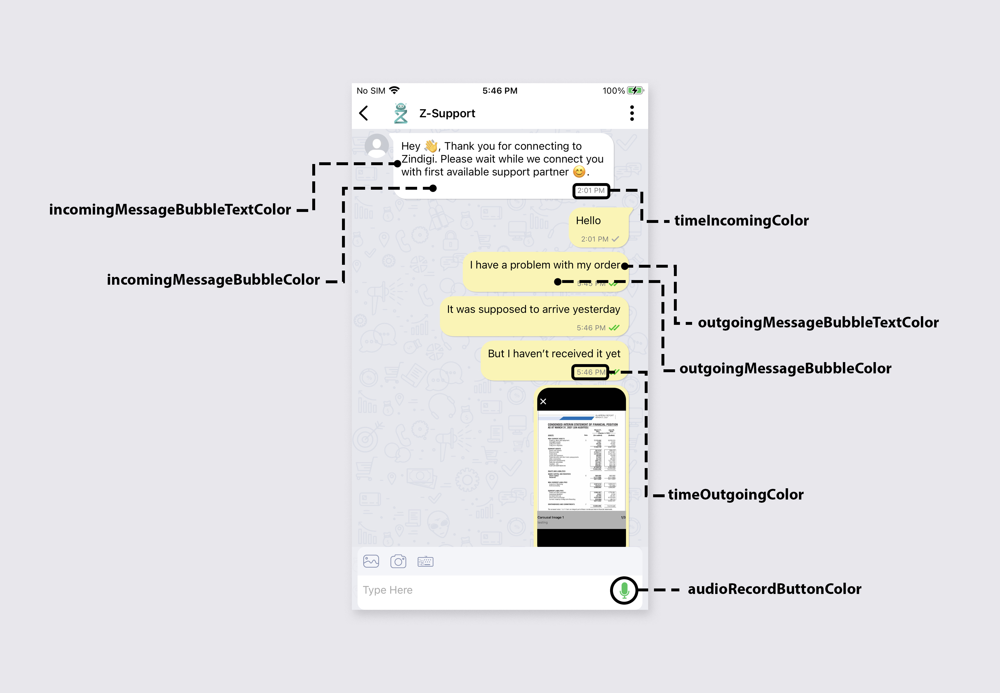

# TelloTalkSdk

TelloTalkSdk is a solution for integrating chat messaging in your app.

## Prerequisites
You must have **AccessKey** and **ProjectToken** to use this SDK in your application.

## Installation

Add SDK dependency in your app build.gradle as following:

```java
implementation 'com.github.tellotalksdk:tellotalksdk_corporate_chat:js_zindigi_2.1'
```
in Project build.gradle
```java

allprojects {
    repositories {
        ...
        maven {
            url "https://jitpack.io"
            credentials { username authToken }
        }
    }
 }
```

in Add the token to $HOME/.gradle/gradle.properties

```java
authToken=jp_p6dmteat0vu8e805pm7dl1k5c0
```


## Usage

Extend your application class with *TelloApplication* class in TelloSDK. Initialize **TelloTalkSdk** client before using any of its features.

```java
TelloApiClient.Builder builder = new TelloApiClient.Builder()
                .accessKey("accessKey")
                .projectToken("projectToken")
                .CRYPTO_LIB_KEY("")
                .CRYPTO_LIB_IV("")
                .setContext(getApplicationContext())
                .notificationIcon("Drawable Resource for notification Small Icon");
        telloApiClient = builder.build();
```
 After initialization you can use **TelloApiClient** object to access SDK features.

 ## Android 12 support

```java
       <uses-permission android:name="android.permission.WRITE_EXTERNAL_STORAGE"
            android:maxSdkVersion="29"/>
    <uses-permission android:name="android.permission.READ_EXTERNAL_STORAGE" />

  <queries>
        <!-- Browser -->
        <intent>
            <action android:name="android.intent.action.VIEW" />
            <data android:scheme="http" />
        </intent>

        <!-- Camera -->
        <intent>
            <action android:name="android.media.action.IMAGE_CAPTURE" />
        </intent>

        <!-- Gallery -->
        <intent>
            <action android:name="android.intent.action.GET_CONTENT" />
        </intent>
    </queries>


```

## Android 11 support

If your Compile and Target SDK is above 28(Android 9) in build.gradle.Then you should add Storage Permission Flag in your AndroidManifest.xml:
```java
<application
 android:requestLegacyExternalStorage="true"
   />
```
Register user to Sdk using following method :
```java
 telloApiClient.registerUser(String profileId, String name,String mobileNumber,String customerType, OnSuccessListener<Boolean> listener)
```
This method will return true/false if user is register or not. 


After this method return success you will start receiving messages and can access SDK user interface.

## Way to enter TelloTalkSdk UI

If you do not have chatlist access you can open individual chat using following method.Before calling this function user need to grant storage permission on application level . 
 ```java
 telloApiClient.openCorporateChat(Activity activity,String initiateMsg,String customData)
```
If user is not loggedIn or feature is not provided, method will throw IllegalStateException.

You can get unread messages count outside the sdk using Listener :
```java
 public interface MessageCounterListener {
    public void onMessageCounterUpdate(int count);
}
```
### Receiving Message Notifications
To receive messages notification using FCM you need to set Updated FCM Token by using following method :
```java
  telloApiClient.updateFcmToken(String fcmToken)
```

And You have to implement FirebaseMessagingService to receive FCM.. Now if you receive FCM with data having entry

**tellotalk-content-available**, you must call following SDK method to receive messages :
```java
  HashMap<String,String> map1 = new HashMap<>();
  map1.putAll(remoteMessage.getData());
  telloApiClient.onMessageNotificationReceived(HashMap<String, String> mapID)
```

### Set Locality (Either English or Urdu)
User is able to set locality for keyboard (Default Mobile Keyboard)
```java
// en for english
// other for urdu
MyApplication.getInstance().telloApiClient.setLocality("en");
```

### Get Broadcast event from FormattedView
Getting Event from broadcast message in One Way Communication.
```java
//com.tellotalksdk.SplashActivit
MyApplication.getInstance().telloApiClient.setPackageName("Entry Point of application");
```

### Release Guide
Add Proguard rules for release build
```java
//Proguard Rules
-keepattributes  * Annotation *
-keepclassmembers class ** {
@org.greenrobot.eventbus.Subscribe <method>;
}
-keep enum org.greenrobot.eventbus.ThreadMode {*;}
-keep class com.tilismtech.** { *; }
```

### Color Changes on UI interface

```java
// UI Customization
     <color name="toolbar_color">#fdfdfc</color>
    <color name="toolbar_title_text_color">#000000</color>
    <color name="outgoingMessageBubbleColor">#FBF39A</color>
    <color name="outgoingMessageBubbleTextColor">#FBF39A</color>
    <color name="incomingMessageBubbleColor">#FBF39A</color>
    <color name="incomingMessageBubbleTextColor">#FBF39A</color>
    <color name="indicator">#009688</color>
    <color name="float_buttons">#009688</color>
    <color name="submit_button_vote">#FFE500</color>
    <color name="timeOutgoingColor">#000000</color>
    <color name="timeIncomingColor">#000000</color>
    <color name="audioRecordButtonColor">#ffc62828</color>
    <color name="messageButtonColor">#ffc62828</color>
```




